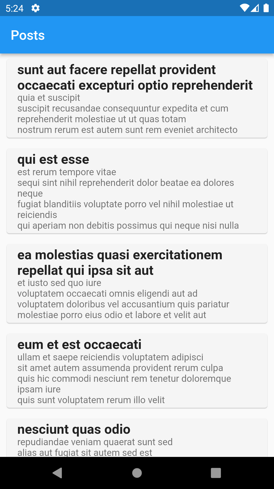
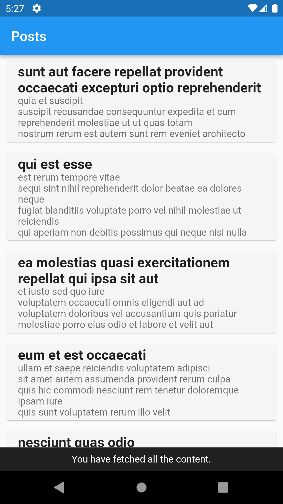

# listview_pagination

Fetching the data from [jsonplaceholder](https://jsonplaceholder.typicode.com/posts) and rendering in the UI.

### Demo

&nbsp;&nbsp;&nbsp;&nbsp;&nbsp;&nbsp;&nbsp;&nbsp;&nbsp;&nbsp;

## Installation

##### 1. Clone the repository

```bash
git clone https://github.com/edilsonmatola/listview_pagination_flutter.git
```

##### 2. Move to the desired folder

```bash
cd listview_pagination_flutter
```

##### 3. To run the app, simply write the following commands:

```bash
flutter pub get
# flutter emulators --launch "emulator_id" (to get Android Simulator)
open -a simulator (to get iOS Simulator)
flutter run
```
